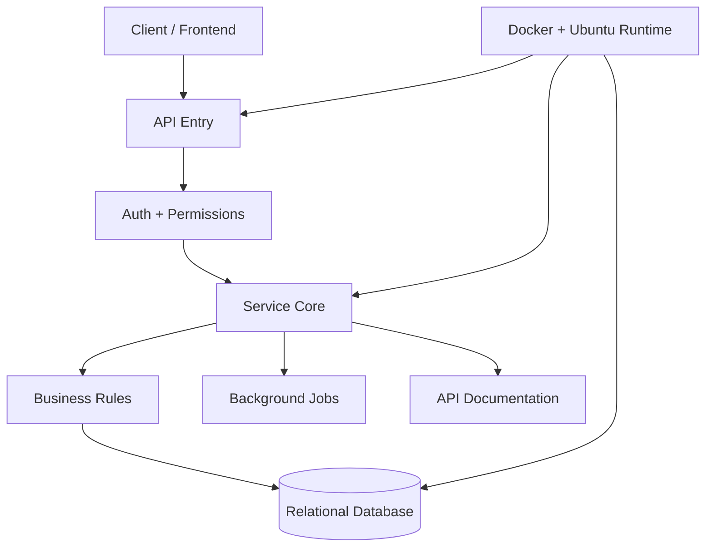

<div align="center">


[](https://git.io/typing-svg)

<br>

[](https://henggdeveloper.me)
[](https://www.linkedin.com/in/chhem-bunheng-25725b295/)
[](mailto:chhembunheng77@gmail.com)
[](https://t.me/definitelynot_heng)

</div>

---

<div align="center">


</div>

## Command Profile

<table>
  <tr>
    <td width="25%" align="center">
      <strong>API Systems</strong><br>
      REST, auth, service layers
    </td>
    <td width="25%" align="center">
      <strong>Data Engines</strong><br>
      PostgreSQL, MySQL, queries
    </td>
    <td width="25%" align="center">
      <strong>Runtime</strong><br>
      Docker, Compose, Ubuntu
    </td>
    <td width="25%" align="center">
      <strong>Delivery</strong><br>
      clean code, docs, deploys
    </td>
  </tr>
</table>

```txt
PROFILE LOCKED
Name       : Chhem Bunheng
Base       : Phnom Penh, Cambodia
Role       : Backend Developer
Focus      : backend systems, microservices, relational data, deployment
Status     : available for backend roles, freelance work, and serious projects
Mindset    : practical architecture, readable code, production-ready services
```

---

## Arsenal

<div align="center">


</div>

<br>

<table>
  <tr>
    <th align="left">Backend route</th>
    <th align="left">Preferred stack</th>
    <th align="left">Best for</th>
  </tr>
  <tr>
    <td><strong>Enterprise API</strong></td>
    <td>Java, Spring Boot, JPA</td>
    <td>structured services, clear domain logic, stable APIs</td>
  </tr>
  <tr>
    <td><strong>Fast service</strong></td>
    <td>C#, ASP.NET Core, EF Core</td>
    <td>performance-focused backend features and internal tools</td>
  </tr>
  <tr>
    <td><strong>Business platform</strong></td>
    <td>PHP, Laravel, Eloquent</td>
    <td>rapid systems, dashboards, admin workflows, CRUD-heavy apps</td>
  </tr>
  <tr>
    <td><strong>Data core</strong></td>
    <td>PostgreSQL, MySQL</td>
    <td>schema design, migrations, query tuning, data cleanup</td>
  </tr>
  <tr>
    <td><strong>Deployment lane</strong></td>
    <td>Docker, Docker Compose, Ubuntu</td>
    <td>repeatable environments and server-ready services</td>
  </tr>
</table>

---

## Infrastructure Blueprint



---

## Operating Principles

<table>
  <tr>
    <td width="50%">
      <strong>Readable beats clever</strong><br>
      Code should explain the system before comments have to.
    </td>
    <td width="50%">
      <strong>Data design comes early</strong><br>
      Good schema decisions save expensive rewrites later.
    </td>
  </tr>
  <tr>
    <td width="50%">
      <strong>Documentation should pay rent</strong><br>
      I document flows, decisions, and API behavior that future work depends on.
    </td>
    <td width="50%">
      <strong>Deployability matters</strong><br>
      A backend is not finished until it can run cleanly outside the local machine.
    </td>
  </tr>
</table>

---

## Signal Dashboard

<div align="center">


<br><br>


<br><br>


<br><br>


</div>

---

## Runtime Config

```javascript
const bunheng = {
  role: "Backend Developer",
  location: "Phnom Penh, Cambodia",
  builds: [
    "REST APIs",
    "database-backed systems",
    "microservices",
    "Dockerized deployments"
  ],
  stack: {
    backend: ["Spring Boot", "ASP.NET Core", "Laravel"],
    database: ["PostgreSQL", "MySQL"],
    runtime: ["Docker", "Docker Compose", "Ubuntu"]
  },
  availableFor: ["backend roles", "API projects", "freelance backend work"]
};
```

---

<div align="center">

### Build the backend. Tune the data. Ship the system.


</div>
