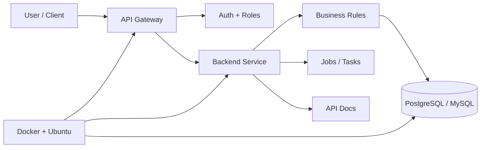

<div align="center">


[](https://git.io/typing-svg)

<br>

[](https://henggdeveloper.me)
[](https://www.linkedin.com/in/chhem-bunheng-25725b295/)
[](mailto:chhembunheng77@gmail.com)
[](https://t.me/definitelynot_heng)

</div>

---

<div align="center">

```txt
┌──────────────────────────── BACKEND OPS CONSOLE ────────────────────────────┐
│ name        Chhem Bunheng                                                   │
│ location    Phnom Penh, Cambodia                                            │
│ role        Backend Developer                                               │
│ focus       APIs, databases, microservices, Dockerized deployments           │
│ status      Open to backend roles, freelance work, and useful projects       │
└─────────────────────────────────────────────────────────────────────────────┘
```

</div>

---

## Mission Board

<table>
  <tr>
    <td width="50%">
      <h3>Build</h3>
      <p>REST APIs, business systems, service layers, auth flows, and backend features that are easy to maintain.</p>
    </td>
    <td width="50%">
      <h3>Optimize</h3>
      <p>Database schemas, SQL queries, migrations, seeders, and data cleanup workflows.</p>
    </td>
  </tr>
  <tr>
    <td width="50%">
      <h3>Ship</h3>
      <p>Docker Compose setups, Ubuntu server environments, and deployment-ready backend services.</p>
    </td>
    <td width="50%">
      <h3>Improve</h3>
      <p>Code structure, documentation, debugging workflows, and production-readiness.</p>
    </td>
  </tr>
</table>

---

## Tech Loadout

<div align="center">


</div>

<br>

```yaml
favorite_routes:
  enterprise_api: Java + Spring Boot + JPA
  fast_service: C# + ASP.NET Core + EF Core
  business_system: PHP + Laravel + Eloquent
  data_layer: PostgreSQL + MySQL
  runtime: Docker + Docker Compose + Ubuntu
```

---

## Service Blueprint



---

## Current Quest Log

<table>
  <tr>
    <th>Track</th>
    <th>Now exploring</th>
  </tr>
  <tr>
    <td>Architecture</td>
    <td>microservices patterns, service boundaries, clean architecture</td>
  </tr>
  <tr>
    <td>Database</td>
    <td>query optimization, relational modeling, safer migrations</td>
  </tr>
  <tr>
    <td>Deployment</td>
    <td>Dockerized services, Ubuntu server workflows, environment setup</td>
  </tr>
  <tr>
    <td>Craft</td>
    <td>clear naming, readable commits, practical documentation</td>
  </tr>
</table>

---

## GitHub Radar

<div align="center">


<br><br>


<br><br>


<br><br>


</div>

---

## Console Output

```javascript
const bunheng = {
  role: "Backend Developer",
  base: "Phnom Penh, Cambodia",
  builds: ["REST APIs", "database-backed systems", "Dockerized services"],
  stack: ["Spring Boot", "ASP.NET Core", "Laravel", "PostgreSQL", "MySQL"],
  values: ["clean code", "clear docs", "stable deploys", "maintainable systems"],
  contact: {
    portfolio: "henggdeveloper.me",
    linkedin: "chhem-bunheng-25725b295",
    telegram: "definitelynot_heng"
  }
};
```

---

<div align="center">

### Ready to build something useful

Backend roles, API projects, microservices work, database systems, and Docker deployments.

<br>


</div>
