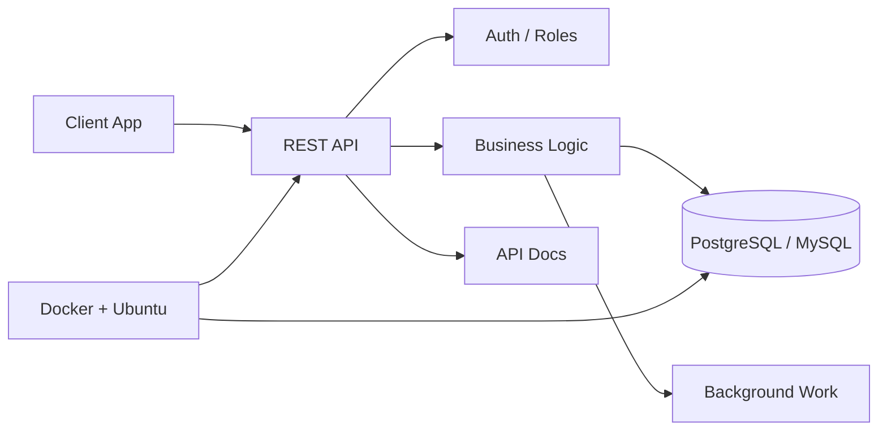

<div align="center">

# Chhem Bunheng

### Backend Systems Developer

I design APIs, data flows, and deployment-ready backend services that stay readable after the first version ships.

<br>

[](https://henggdeveloper.me)
[](https://www.linkedin.com/in/chhem-bunheng-25725b295/)
[](mailto:chhembunheng77@gmail.com)
[](https://t.me/definitelynot_heng)

</div>

---

<div align="center">

```txt
SYSTEM PROFILE
Location        Phnom Penh, Cambodia
Role            Backend Developer
Mode            Open to backend roles and project work
Specialty       APIs, databases, services, containers
Environment     Ubuntu, Docker, Git, SQL
```

</div>

---

## Backend Control Room

<table>
  <tr>
    <td width="33%">
      <strong>API Layer</strong><br>
      REST endpoints, auth flows, validation, service boundaries, practical documentation.
    </td>
    <td width="33%">
      <strong>Data Layer</strong><br>
      PostgreSQL, MySQL, schema design, migrations, query tuning, data cleanup.
    </td>
    <td width="33%">
      <strong>Runtime Layer</strong><br>
      Docker, Docker Compose, Ubuntu Server, environment setup, deployable services.
    </td>
  </tr>
</table>

---

## Service Map



---

## Stack Signals

<div align="center">


</div>

<br>

<table>
  <tr>
    <th>Use case</th>
    <th>Preferred tools</th>
  </tr>
  <tr>
    <td>Structured enterprise APIs</td>
    <td>Java, Spring Boot, JPA</td>
  </tr>
  <tr>
    <td>Fast backend services</td>
    <td>C#, ASP.NET Core, EF Core</td>
  </tr>
  <tr>
    <td>Rapid business systems</td>
    <td>PHP, Laravel, Eloquent</td>
  </tr>
  <tr>
    <td>Relational data work</td>
    <td>PostgreSQL, MySQL, Navicat</td>
  </tr>
  <tr>
    <td>Local and server runtime</td>
    <td>Docker, Docker Compose, Ubuntu</td>
  </tr>
</table>

---

## How I Work

```yaml
principles:
  - simple structure before clever abstraction
  - readable commits and clear naming
  - database design before feature rush
  - documentation where it saves future time
  - deployable services, not only local demos
```

---

## Current Build Queue

```javascript
const focus = {
  backend: ["REST APIs", "microservices", "clean architecture"],
  database: ["schema design", "query optimization", "data consistency"],
  deployment: ["Docker Compose", "Ubuntu Server", "environment setup"],
  learning: ["system design", "service boundaries", "production patterns"]
};
```

---

## GitHub Telemetry

<div align="center">


<br><br>


</div>

---

<div align="center">

### Available for backend work

APIs, database-backed systems, Dockerized services, and backend project collaboration.


</div>
