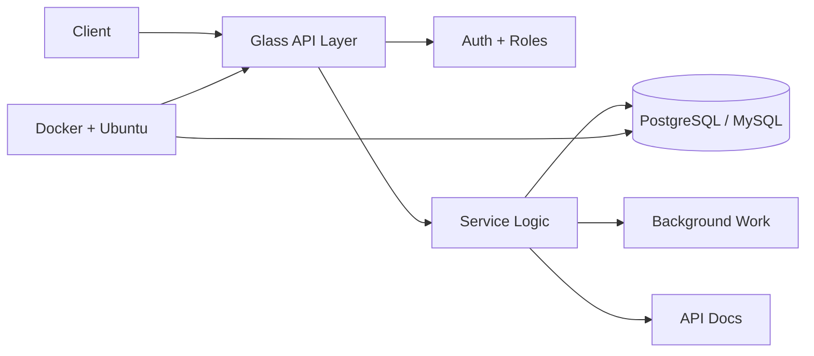

<div align="center">


[](https://git.io/typing-svg)

<br>

[](https://henggdeveloper.me)
[](https://www.linkedin.com/in/chhem-bunheng-25725b295/)
[](mailto:chhembunheng77@gmail.com)
[](https://t.me/definitelynot_heng)

</div>

---

<div align="center">

### Liquid Glass Backend Profile

Backend developer from Phnom Penh, Cambodia, focused on building API systems, relational data layers, and Dockerized services with clean structure.

</div>

<table>
  <tr>
    <td width="25%" align="center">
      <strong>API Surface</strong><br>
      REST, auth, validation
    </td>
    <td width="25%" align="center">
      <strong>Data Core</strong><br>
      PostgreSQL, MySQL
    </td>
    <td width="25%" align="center">
      <strong>Service Logic</strong><br>
      clean layers, clear flows
    </td>
    <td width="25%" align="center">
      <strong>Runtime</strong><br>
      Docker, Ubuntu
    </td>
  </tr>
</table>

```txt
╭──────────────────────────── profile.glass ────────────────────────────╮
│ name       Chhem Bunheng                                               │
│ role       Backend Developer                                           │
│ location   Phnom Penh, Cambodia                                        │
│ focus      APIs, databases, microservices, deployment                  │
│ status     Open to backend roles and project work                      │
╰────────────────────────────────────────────────────────────────────────╯
```

---

## Glass Stack

<div align="center">


</div>

<br>

<table>
  <tr>
    <th align="left">Layer</th>
    <th align="left">Tools</th>
    <th align="left">What I use it for</th>
  </tr>
  <tr>
    <td><strong>Enterprise APIs</strong></td>
    <td>Java, Spring Boot, JPA</td>
    <td>structured services, domain logic, stable REST endpoints</td>
  </tr>
  <tr>
    <td><strong>Fast Services</strong></td>
    <td>C#, ASP.NET Core, EF Core</td>
    <td>clean backend features, internal tools, performance-focused APIs</td>
  </tr>
  <tr>
    <td><strong>Business Systems</strong></td>
    <td>PHP, Laravel, Eloquent</td>
    <td>rapid platforms, admin workflows, database-backed apps</td>
  </tr>
  <tr>
    <td><strong>Data Layer</strong></td>
    <td>PostgreSQL, MySQL</td>
    <td>schema design, migrations, query optimization, cleanup workflows</td>
  </tr>
  <tr>
    <td><strong>Deployment</strong></td>
    <td>Docker, Docker Compose, Ubuntu</td>
    <td>repeatable environments and server-ready services</td>
  </tr>
</table>

---

## System Flow



---

## Design Principles

<table>
  <tr>
    <td width="50%">
      <strong>Clarity first</strong><br>
      Backend code should be easy to scan, debug, and extend.
    </td>
    <td width="50%">
      <strong>Stable data shape</strong><br>
      Good schema choices make the rest of the system calmer.
    </td>
  </tr>
  <tr>
    <td width="50%">
      <strong>Simple service boundaries</strong><br>
      Each layer should have a clear job and a clean handoff.
    </td>
    <td width="50%">
      <strong>Deployable by design</strong><br>
      A service should run cleanly beyond the local machine.
    </td>
  </tr>
</table>

---

## Soft Metrics

<div align="center">


<br><br>


<br><br>


<br><br>


</div>

---

## Runtime Object

```javascript
const bunheng = {
  role: "Backend Developer",
  location: "Phnom Penh, Cambodia",
  stack: {
    backend: ["Spring Boot", "ASP.NET Core", "Laravel"],
    database: ["PostgreSQL", "MySQL"],
    runtime: ["Docker", "Docker Compose", "Ubuntu"]
  },
  builds: ["REST APIs", "database systems", "microservices", "deployable services"],
  availableFor: ["backend roles", "API projects", "freelance backend work"]
};
```

---

<div align="center">

### Clean backend systems, polished from data to deployment.


</div>
